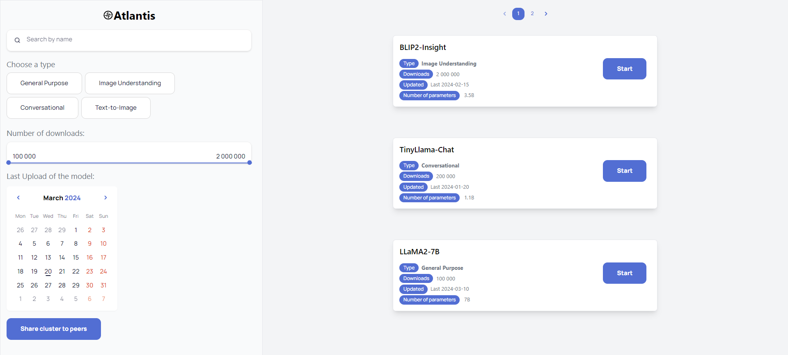
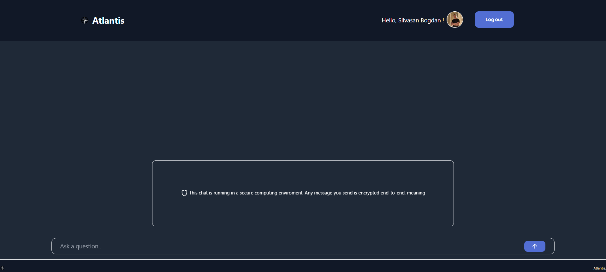

# Atlantis

Atlantis is a secure, customizable and easy to use platform for creating and managing applications by leveraging AI models. It is designed to empower institutions and organizations to inform and educate individuals from any environment and with any background.

# How to use it

In order to create your application, you need to have a running Kubernetes cluster and provide credentials to this application.

Once started, you can login as a creator using your `Github` or your `Google` account, and start customizing your application.

You can access available models in model selection page, and add them to your application.

After selecting your model, you will be provided with all the relevant data about that model and will be directed to the model customization page.

When everything is ready, your model will be deployed and you will be given a URL to access your application. This is the URL you can give to your users to access your application.

# What makes it powerful

Atlantis offers top of the line security features to ensure that your data is safe and secure. It also provides a wide range of customization options to make your application unique and tailored to your needs.

Leveraging [Constellation](https://github.com/edgelesssys/constellation), Atlantis is able to provide a secure and private environment for your application. This means that your data is never shared with anyone, including the party hosting the application. 

